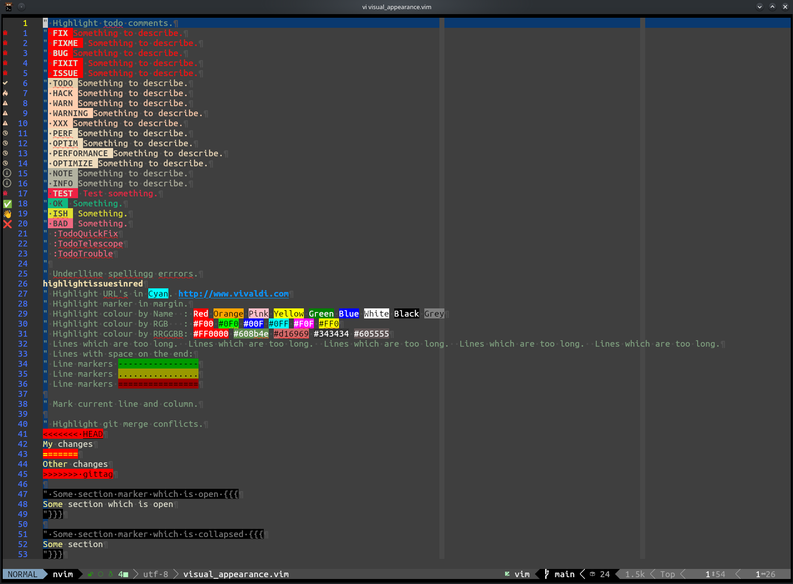
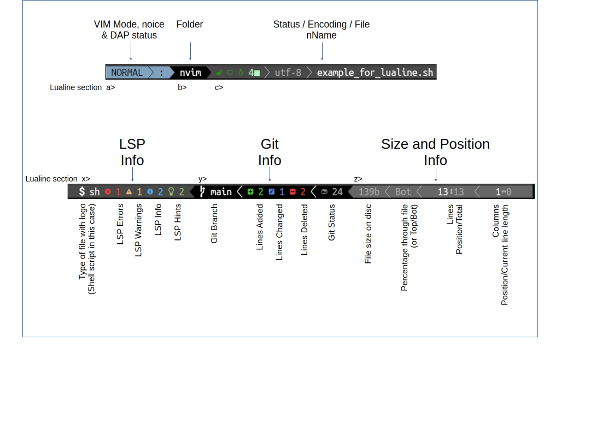
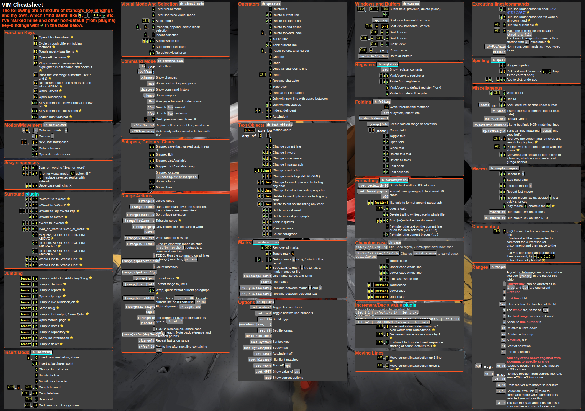

<!-- Shields -->

<!-- Main Image -->

<!-- Introduction -->
This is a set of config files for the **brilliant** configuration project
[lazyvim](https://www.lazyvim.org) been using
VI on and off as my daily editor since the early 1990's and
this setup is the best I've seen so I've just plagiarized it and added a
few of my own twists.

I was using [LunarVim](https://www.lunarvim.org) but
started to have more and more issues, also it appears not to be maintained any more,
so I jumped in LazyVim in 2026.

The main changes are documented below:

- My config for status line.
- My dashboard.
- Custom Keybindings.
- Custom Colours.
- and much more.

If your interested my website is 

## Contents

- [Installation](#installation)
- [Visual Appearance](#visual-appearance)
- [Status Line](#status-line)
- [Extra Plugins](#extra-plugins)
- [Key Bindings](#key-bindings-cheatsheet)
- [Some Useful Links](#some-useful-links)

## Installation

- Follow the instructions on [The Lazy Vim Site](https://www.lazyvim.org)
- Download this repo to `~/.config/nvim`

## Visual Appearance

- I use [zenburn-m theme](https://github.com/rainstf/zenburn-m).
  One of the reasons for this is that Zenburn available in virtually
  any plug-in/app/program that allows theming, so I can near consistent code theming
  everywhere.
- I've added vertical markers at 80 and 120 characters.
  - The status line displays the current column and line
    length, these change colour at 80 and 120 characters.
- The current cursor line is highlighted in light blue
- The current cursor column is highlighted in light red
- Whitespace at the end of a line in highlighted in bright red.
- Margin:
  - Current line number is highlighted in Yellow
  - Relative line numbers are shown in RoyalBlue
  - Markers are shown
  - Git changes are shown
  - Folding marks are also shown in the margin
  - etc.

## Status line

The [status line configuration can be found here](https://github.com/jimcornmell/nvim/blob/main/lua/plugins/lualine.lua)

This image shows what is in the different sections.

The line is split into 6 main sections, 3 on the left and 3 on the right, all is configured in the [lualine.lua](lua/plugins/lualine.lua) file, all are explained in the diagram above, some extra details:

  - [noice](https://github.com/folke/noice.nvim)
  - [DAP](https://www.lazyvim.org/extras/dap/core)
  - File status has 4 symbols:
    - Padlock for read only files, open lock for writable files
    - Green Circle unmodified, Red Circle modified
    - Line Ending, Linux , Mac  or Windows 
    - Number of tabs and style:
    - So this  is **writable** file, that is **unmodified** with **linux** line endings and it uses **4-spaces** for tabbing
    - And this  is a **read-only** file, that is **modified** and has **windows** line endings and uses **tabs** set to **2 chars**.

## Extra Plugins

I've added a few extra plugins I use to the configuration:

- [Dashboard](https://www.lazyvim.org/extras/ui/dashboard-nvim)
- [Dial](https://github.com/monaqa/dial.nvim) I've enabled a bunch of the predefined "increment's", also added a few of my own, e.g: True<->False and full month names, logging levels and more.  [See the config for details](lua/user/dial.lua)I
- [Hop](https://github.com/smoka7/hop.nvim) Better motions with <kbd>S</kbd>
- [Todo comments](https://github.com/folke/todo-comments.nvim) With a few tweaks....
- See the [plugins](lua/plugins) folder for more details.

## Key Bindings-Cheatsheet

Note this cheatsheet is available as a HTML file, which is accessed by hitting <kbd>F1</kbd> in vim.
See my dotfiles for a simple bash script to convert this GitHut markdown file into HTML (and thus PNG).

- [Markdown Cheatsheet](cheatsheet.md)
- [HTML Cheatsheet](cheatsheet.html)
- [PNG Cheatsheet](./media/cheatsheet.png)

## Some Useful Links

|                                                          |             |                          |
| :-------------------------------------------------------------------------------------------------------------------------------------: |:-----------------------------------------------------------------------------------------------------------------:| :---------------------------------------------------------------------------------------------------------------: |
|                      |  |    |
|  |               |  |
|                                             |                                                      &nbsp;                                                       |                                                      &nbsp;                                                       |
